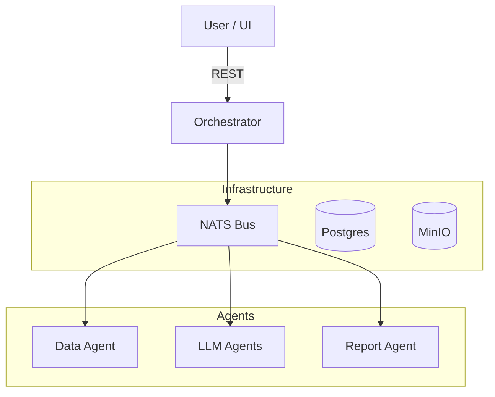

# AI Creative Marketing Assistant

> **A Multi-Agent System for generating validated, culturally-aware Creative Marketing Strategies.**

## 🚀 Overview

This project is an **AI-powered Marketing Analysis System** designed to help creative teams, founders, and growth leads craft high-converting messaging.

Unlike generic LLM wrappers, this system uses a **Multi-Agent Architecture** to:
1.  **Validate** input data before processing.
2.  **Triangulate** insights from multiple models (GPT-4, Gemini, Grok) to reduce hallucinations (Planned M1).
3.  **Localize** content for specific cultural nuances.
4.  **Export** polished reports (PDF) and design-ready assets.

**Focus**: This tool specializes in **Creative Strategy** (Personas, Hooks, Angles, Positioning). It does *not* handle Performance Marketing execution (Media buying, pixel tracking, etc.).

## 🏗 Architecture

The system follows an Event-Driven Microservices architecture powered by **NATS JetStream**.



### Core Services
- **Orchestrator**: The "Brain". Manages task routing, discovery, and resource access.
- **Agent Data**: Validates user questionnaires and normalizes input.
- **Agent Report**: Compiles analysis into Markdown/PDF.
- **Agent LLM Stub**: (Mock) Simulates the creative strategist brain (for M0).

## 🛠 Tech Stack

- **Runtime**: Node.js, TypeScript
- **Messaging**: NATS JetStream
- **Database**: PostgreSQL (Jobs, Artifacts)
- **Storage**: MinIO (S3-compatible)
- **Monorepo**: TurboRepo

## ⚡️ Quick Start

### Prerequisites
- Docker & Docker Compose
- Node.js > 18 (for local dev)

### Run the Stack

1.  **Start Infrastructure & Services**:
    ```bash
    docker-compose up -d --build
    ```

2.  **Verify Services**:
    - Orchestrator: `http://localhost:3000`
    - MinIO Console: `http://localhost:9001` (User: `admin`, Pass: `password`)

3.  **Submit a Test Task**:
    ```bash
    curl -X POST http://localhost:3000/tasks \
      -H "Content-Type: application/json" \
      -d '{
        "type": "data",
        "payload": {
            "questionnaire": {
                "productName": "SuperSaaS",
                "targetAudience": "Founders",
                "objectives": ["PLG"],
                "country": "US"
            }
        }
      }'
    ```

## 🗺 Roadmap

- [x] **M0: Foundations** (Infra, Bus, Discovery, Base Agents)
- [ ] **M1: Intelligence** (Multi-LLM consensus, Merge Agent)
- [ ] **M2: Localization** (Cultural Agent, Figma Export)

## 📄 License

MIT
